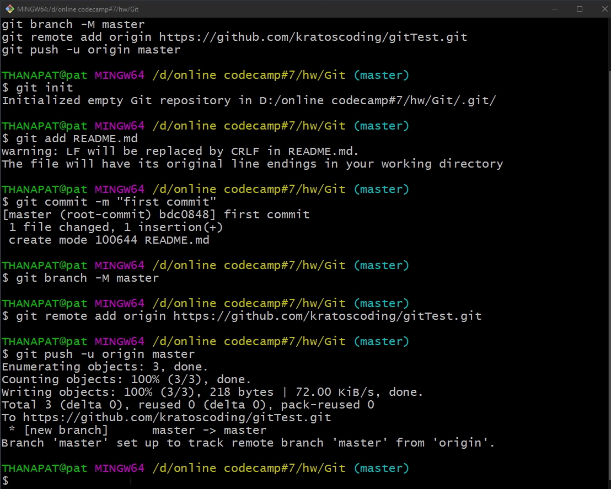

# gitTest

## การบ้าน Git ข้อที่ 1 และ 2 รวมอยู่ใน readme.md นี้

[link picture](https://ibb.co/gFWSb0W)
#Git-test-codecamp7
## title h2
### title h3
#### title h4
##### title h5
###### title h6

**ตัวหนา** ไม่หนา __ตัวหนา__

_เอียง_ *เอียง* ไม่เอียง

__*หนาด้วยเอียงด้วย*__ ***หนาด้วยเอียงด้วย*** 

**_content_**

>content
>>content2
>>>content3
1. one
2. two
3. three

+ head
- head
* head
*** 
ทำให้มีเส้นคั่น
---
___

![this link for picture] (paste link here)
[this link to website](paste link here)

            ย่อหน้าให้จากการกด tab 3 ครั้ง
            จะพิมพ์อะไรก็ได้ลงไปตรงนี้

|header | header |
--|--
|**content** | content|
*content* | content
***content*** | content
[link google](https://www.google.co.th) | content